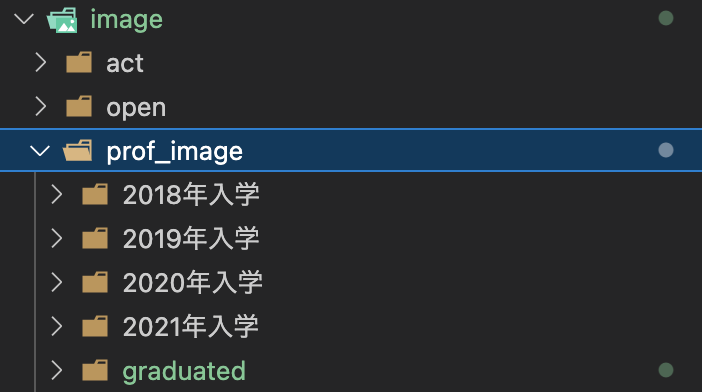

# 関研究室のホームページ
## 概要
2022年度の卒研生が卒業したため，2023年度用に研究室ホームページを変更する必要がある．そこで変更内容をここに記す．開発メンバーはGitHubのアカウントを作成し，関研究室用のGitHubのOrganizationに所属する．この開発用リポジトリはPrivateとし，関研究室限りとする．

基本的なメンバーは以下の担当が行う．
- web更新　--> 広報担当
- スライドの挿入など --> 環境担当

昨年度特に企画担当に仕事がなかったため，状況によって広報担当に仕事を振っても良い．来年度の引き継ぎのため相吉澤も参加してもらう．

質問事項がある場合は篠崎に連絡すること．

## 開発情報
基本的にfeature/OO のブランチで編集を行いdevelopブランチに統合（マージ）する．  
developブランチで一度完成版ができたらmainに統合する．

## 言語
[](https://skillicons.dev)  　　


### 変更事項
- 活動報告　2022年度
- メンバー紹介/在籍メンバー
- メンバー紹介/OB＆OG
- 画像の追加
- ヘッダーのプルダウンメニューで活動報告の2022年度画像の追加をすべてのページで行う
- topページの更新履歴に更新日及び更新内容を追加する
#### 活動報告　2022年度
2022年度の１年間の活動報告をまとめる．過去の活動報告を参考にすると良い．
1. wordやテキストで文章を作成し責任者に報告する．
2. 責任者の承認後，feature/activityブランチにてhtmlを編集する．
3. 完成したらdevelopブランチにプルリクエストを送る．（プルリクエストを送る直前にページ下部の最終変更日及びバージョンを編集する．）
4. プルリクエストが承認されたら終了．
#### メンバー紹介/在籍メンバー
メンバー紹介/在籍メンバーでは新体制のメンバーが表示されるようにする．
変更項目は以下の通り．

- 4年の項目に新４年の情報を追加する．  
- 新3年加入時に「一言/やりたいこと」，プロフィール写真を集め3年の項目に追加する．  
- 大学院生が2名となるためそこのレイアウトの編集を行う必要がある．大学院生の部分が現在左寄せとなっているので中央寄せとし，先生のデザインと同じようにする．

1. exelで名前，担当，研究内容（一言/やりたいこと)をまとめ責任者に報告する．
2. 責任者の承認後，feature/memberブランチにてhtmlを編集する．
3. 完成したらdevelopブランチにプルリクエストを送る．（プルリクエストを送る直前にページ下部の最終変更日及びバージョンを編集する．）
4. プルリクエストが承認されたら終了．

#### メンバー紹介/OB＆OG
卒業生の名前および研究内容をまとめている．表示は名前順となっており，それにしたがって卒業生の内容を追加する．

1. feature/obogブランチにてhtmlを編集する．  
>1.   htmlで名前順に配置されているのでそれに従い直近の卒業生の名前，研究内容を追加する．
2. 完成したらdevelopブランチにプルリクエストを送る．（プルリクエストを送る直前にページ下部の最終変更日及びバージョンを編集する．）
3. プルリクエストが承認されたら終了．

#### 画像の追加
基本的に以下の項目を追加する．
- 新配属メンバーの画像
- 2022年度活動報告のアイコン画像の追加
- 活動報告で使用する画像の追加

編集は feature/imageブランチで行う．  
対象となるPATH
```
public_html/image/
```
##### **新配属メンバーの画像**
```
public_html/image/prof_image/
```
で新規フォルダ"2021年入学"を作成しその中に新3年生のプロフィール画像を追加する．この時画像は縦横比4:3の比率で表示される．そのためプロフィール画像を集める際は縦横比4:3の比率の画像にしてもらう．  
> 仕様：  
> 縦横比　160px × 120px　（4：3)
> ファイルネーム　familyname_prof.jpg  (拡張子は.jpgのみ受け付ける)

##### **2022年度活動報告のアイコン画像の追加**

```
public_html/image/nav_act_rep2022_S.png
```
はあるので，同じディレクトリに

```
nav_act_rep2022.png
```
を追加する．多分画像は共有フォルダに存在している．

##### **活動報告で使用する画像の追加（仮）**
活動報告で使用する画像があれば追加する．


それぞれの項目ごとに完成したらdevelopブランチにプルリクエストを送る．（プルリクエストを送る直前にページ下部の最終変更日及びバージョンを編集する．）  
プルリクエストが承認されたら終了．

#### ヘッダーのプルダウンメニューで活動報告の2022年度画像の追加をすべてのページで行う
すべてのfeatureの作業が終了したらすべてのページから2022年度活動報告に遷移できるようにヘッダーを編集する．


--- 
## ブランチについて
- main  
　リリースした時点のソースコードを管理するブランチ

- develop (mainから派生)  
　開発作業の主軸となるブランチ

- feature (developから派生)  
　実装する機能毎のブランチ (feature/◯◯, feature/xxなど)

- release (developから派生)  
　developでの開発作業完了後、リリース時の微調整を行うブランチ
　(バージョン番号の変更などで使いました。)

- hotfix (masterから派生)  
　リリースされた製品に致命的なバグ(クラッシュなど)があった場合に緊急対応をするためのブランチ  

イメージ画像（画像でmasterの部分はmainとして考える）


参考：Gitのブランチモデルについて - Qiita，https://qiita.com/y-okudera/items/0b57830d2f56d1d51692

---
## Visual Studio 拡張機能おすすめ
- [Japanese Language Pack for Visual Studio Code](https://marketplace.visualstudio.com/items?itemName=MS-CEINTL.vscode-language-pack-ja)  
VSCodeの日本語パッケージ

- [HTML CSS Support](https://marketplace.visualstudio.com/items?itemName=ecmel.vscode-html-css)  
HTML，CSSのタグ補完をしてくれる．

- [Path Autocomplete](https://marketplace.visualstudio.com/items?itemName=ionutvmi.path-autocomplete)  
PATHを入力する時にそのディレクトリの内容を表示してくれる．

- [zenkaku](https://marketplace.visualstudio.com/items?itemName=mosapride.zenkaku)  
全角スペースがあると色付けしてくれる．

- [CSS Peek](https://marketplace.visualstudio.com/itemdetails?itemName=pranaygp.vscode-css-peek)  
HTMLのIDやClassから対応するCSSの内容が確認できる．

- [Live Server](https://marketplace.visualstudio.com/items?itemName=ritwickdey.LiveServer)  
いちいちHTMLを開かなくても自動更新してwebを表示してくれる．

- [Highlight Matching Tag](https://marketplace.visualstudio.com/items?itemName=vincaslt.highlight-matching-tag)  
タグの開始と終了を知らせる．

- [Auto Rename Tag](https://marketplace.visualstudio.com/items?itemName=formulahendry.auto-rename-tag)  
タグ名変更時に対応する終了タグ名も同時に変更する．


- [Markmap](https://marketplace.visualstudio.com/items?itemName=gera2ld.markmap-vscode)  
Markdownで書かれている文章を項目ごとでマップとして作成してくれる．

- [Paste Image](https://marketplace.visualstudio.com/items?itemName=mushan.vscode-paste-image)  
コピーした画像を貼り付けられ，カレントディレクトリに画像を保存してくれる．（保存先は変更可能)

- [GitHub Markdown Preview](https://marketplace.visualstudio.com/items?itemName=bierner.github-markdown-preview)  
Markdown形式の文章のプレビューを確認できるパッケージ


## web知識おすすめサイト
### その他
- [爆速コーディングを実現！Emmetの使い方とVSCodeのおすすめ設定まとめ](https://webdesign-trends.net/entry/13588)


### 関係ない情報
MarkdownとかMarpとか今は必要ないけど割と便利な情報まとめ  
- [【VS Code + Marp】Markdownから爆速・自由自在なデザインで、プレゼンスライドを作る](https://qiita.com/tomo_makes/items/aafae4021986553ae1d8)
- [Kroki.io](https://kroki.io/)  
PlantUML, Graphviz, Mermaidなどお馴染みの記法から、少しニッチなものまで、20以上の記法に対応する、オープンソースのレンダリングエンジン、Web APIサービス。

- [Draw.io](https://marketplace.visualstudio.com/items?itemName=hediet.vscode-drawio)  
VSCodeでDraw.ioが使えるようになったらしい！ - Qiita
お馴染みのSVGエディタ。VSCodeのプラグインで、オフラインエディタをVSCode画面内で扱える。またそこで保存したSVGを、そのままMarpスライド内で活用できる。

- [Vega](https://vega.github.io/vega/)  
データセットと、その描画方法をJSONで指定すると、綺麗なグラフを返してくれるVega。Draw.io同様、VSCodeプラグインがあり、生成したSVGを、Marpスライド内で活用できる。

- [VSCodeでMarkdownの改行をする](https://qiita.com/fuk101/items/0fea05c93e70195275c3)


## 進捗状況
1. ./public_html/image/prof_image/  
以下に`/graduated/`を作成し，その中に卒業生のプロフィール画像を格納した．



